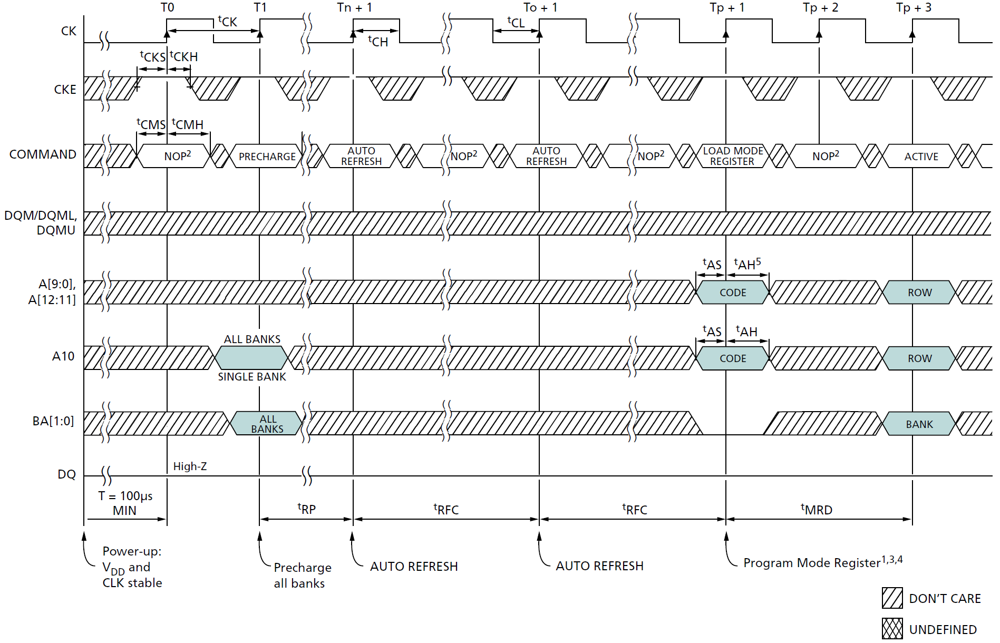
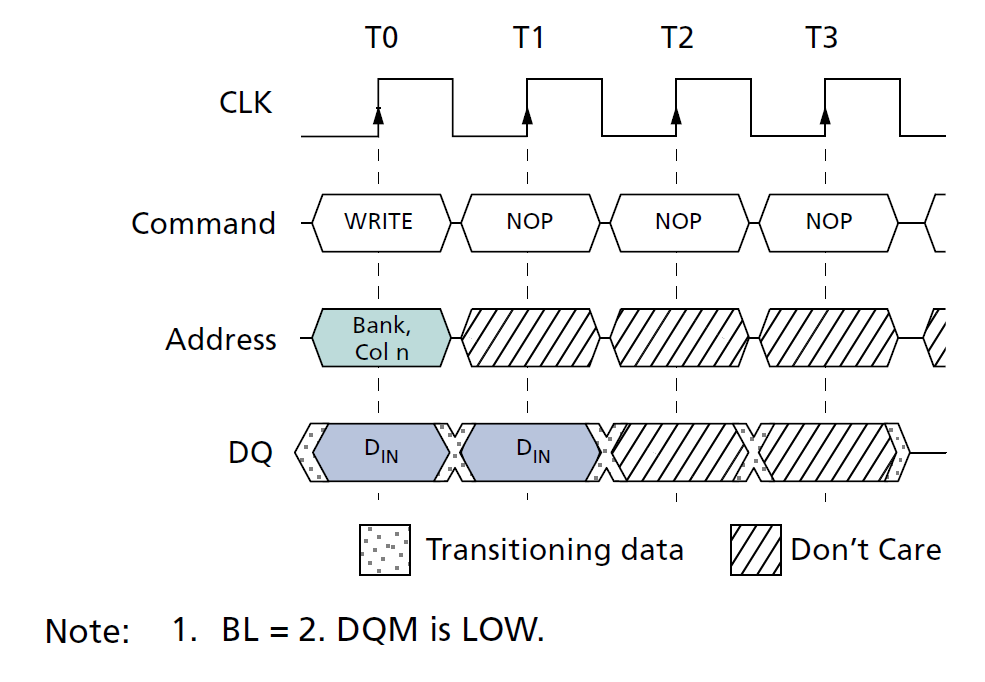
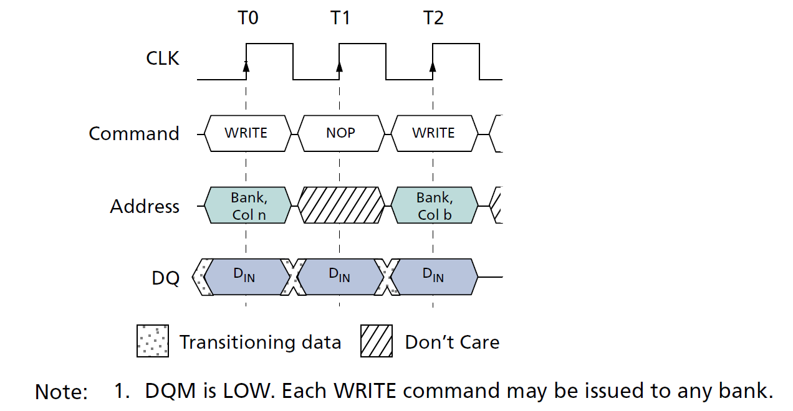
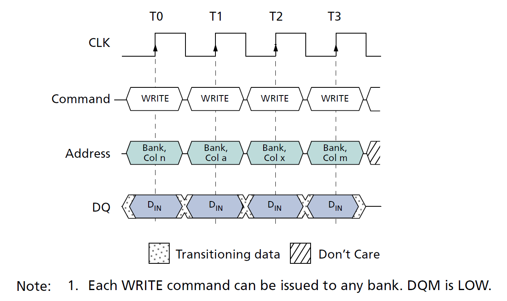
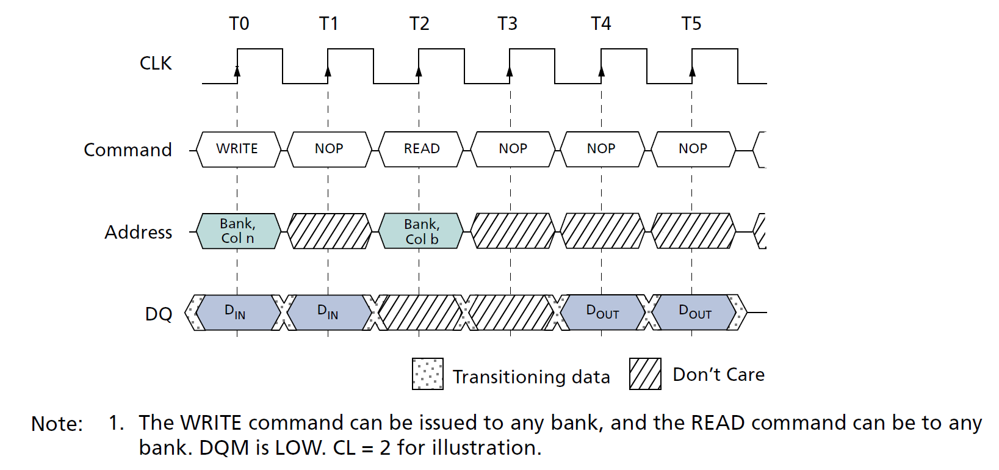
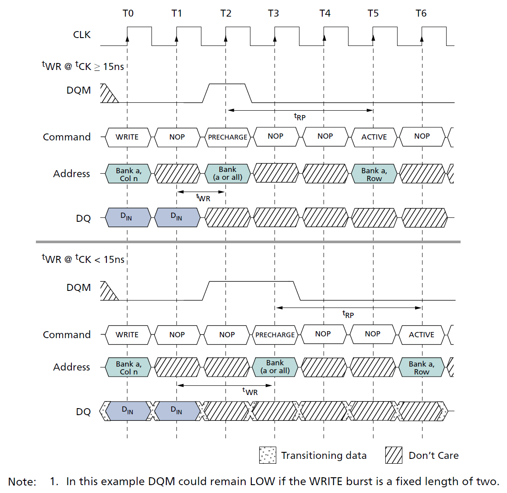
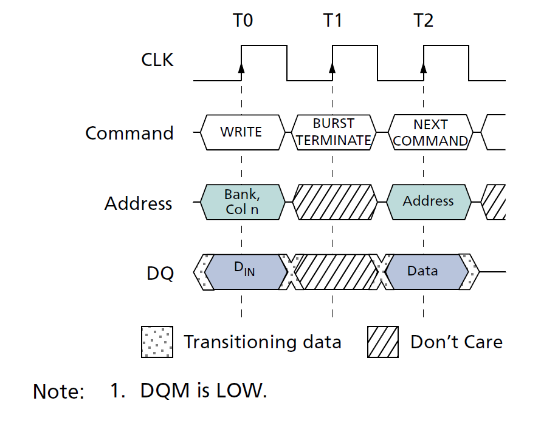

# MT48LC16M16A2TG-75ITD

## Initialization

SDRAM must be powered up and initialized in a predefined manner. Operational procedures other than those specified may result in undefined operation. After power is applied to VDD and VDDQ (simultaneously) and the clock is stable (stable clock is defined as a signal cycling within timing constraints specified for the clock pin), the SDRAM requires a 100μs delay prior to issuing any command other than a COMMAND INHIBIT or NOP. Starting at some point during this 100μs period and continuing at least through the end of this period, COMMAND INHIBIT or NOP commands must be applied.

SDRAM 必须以预定的方式通电和初始化。除了指定的操作程序外的操作都可能导致未定义的行为。在 VDD 和 VDDQ 通电（同时）且时钟稳定后（稳定时钟定义为在时钟引脚指定的时序约束内循环的信号），SDRAM 需要 100μs 的延迟才能发出除 COMMAND INHIBIT 或 NOP 之外的任何命令。从这 100μs 期间的某个时间点开始，至少持续到该期间结束，必须应用 COMMAND INHIBIT 或 NOP 命令。

After the 100μs delay has been satisfied with at least one COMMAND INHIBIT or NOP command having been applied, a PRECHARGE command should be applied. All banks must then be precharged, thereby placing the device in the all banks idle state.

在满足 100μs 的延迟并应用至少一个 COMMAND INHIBIT 或 NOP 命令之后，应执行 PRECHARGE 命令。这样所有的 bank 都会被预充电，从而使设备的所有 bank 进入 IDLE 状态。

Once in the idle state, at least two AUTO REFRESH cycles must be performed. After the AUTO REFRESH cycles are complete, the SDRAM is ready for mode register programming. Because the mode register will power up in an unknown state, it must be loaded prior to applying any operational command. If desired, the two AUTO REFRESH commands can be issued after the LMR command.

一旦处于 IDLE 状态，必须执行至少两个 AUTO REFRESH 周期。AUTO REFRESH 周期完成后，SDRAM 即可进行模式寄存器的编程。由于模式寄存器将在未知状态下启动，因此必须在应用任何操作命令之前加载它。如果需要，两个 AUTO REFRESH 命令也可以在 LMR 命令之后发出。

The recommended power-up sequence for SDRAM:

推荐的 SDRAM 上电顺序：

1. Simultaneously apply power to VDD and VDDQ.
2. Assert and hold CKE at a LVTTL logic LOW since all inputs and outputs are LVTTL-compatible.
3. Provide stable CLOCK signal. Stable clock is defined as a signal cycling within timing constraints specified for the clock pin.
4. Wait at least 100μs prior to issuing any command other than a COMMAND INHIBIT or NOP.
5. Starting at some point during this 100μs period, bring CKE HIGH. Continuing at least through the end of this period, 1 or more COMMAND INHIBIT or NOP commands must be applied.
6. Perform a PRECHARGE ALL command.
7. Wait at least tRP time; during this time NOPs or DESELECT commands must be given. All banks will complete their precharge, thereby placing the device in the all banks idle state.
8. Issue an AUTO REFRESH command.
9. Wait at least tRFC time, during which only NOPs or COMMAND INHIBIT commands are allowed.
10. Issue an AUTO REFRESH command.
11. Wait at least tRFC time, during which only NOPs or COMMAND INHIBIT commands are allowed.
12. The SDRAM is now ready for mode register programming. Because the mode register will power up in an unknown state, it should be loaded with desired bit values prior to applying any operational command. Using the LMR command, program the mode register. The mode register is programmed via the MODE REGISTER SET command with BA1 = 0, BA0 = 0 and retains the stored information until it is programmed again or the device loses power. Not programming the mode register upon initialization will result in default settings which may not be desired. Outputs are guaranteed High-Z after the LMR command is issued. Outputs should be High-Z already before the LMR command is issued
13. Wait at least tMRD time, during which only NOP or DESELECT commands are allowed

1. 同时给 VDD 和 VDDQ 供电。
2. 保持 CKE 为 LVTTL 逻辑低电平，因为所有输入和输出都是 LVTTL 兼容的。
3. 提供稳定的时钟信号。稳定时钟定义为在时钟引脚指定的时序约束内循环的信号。
4. 在发出除 COMMAND INHIBIT 或 NOP 之外的任何命令之前等待至少 100μs。
5. 在这 100μs 期间的某个时间点开始，将 CKE 拉高。至少持续到该期间结束，必须应用 1 个或多个 COMMAND INHIBIT 或 NOP 命令。
6. 执行 PRECHARGE ALL 命令。
7. 等待至少 tRP 时间；在此期间必须给出 NOP 或 DESELECT 命令。所有 bank 都将完成预充电，从而使设备的所有 bank 进入 IDLE 状态。
8. 发出 AUTO REFRESH 命令。
9. 等待至少 tRFC 时间，在此期间只允许 NOP 或 COMMAND INHIBIT 命令。
10. 发出 AUTO REFRESH 命令。
11. 等待至少 tRFC 时间，在此期间只允许 NOP 或 COMMAND INHIBIT 命令。
12. SDRAM 现在已准备好进行模式寄存器编程。因为模式寄存器将在未知状态下启动，所以在应用任何操作命令之前，应将其加载为所需的位值。使用 LMR 命令可以编程模式寄存器。模式寄存器通过 MODE REGISTER SET 命令（BA1 = 0，BA0 = 0）进行编程，并保留存储的信息，直到再次编程或设备断电。在初始化时不编程模式寄存器将导致默认设置，这可能不是所需的。在发出 LMR 命令后，输出保证为高阻态。在发出 LMR 命令之前，输出应该已经是高阻态。
13. 等待至少 tMRD 时间，在此期间只允许 NOP 或 DESELECT 命令

At this point the DRAM is ready for any valid command

此时 DRAM 已准备好接受任何有效命令

Note:
More than two AUTO REFRESH commands can be issued in the sequence. After steps 9 and 10 are complete, repeat them until the desired number of AUTO REFRESH + tRFC loops is achieved.

注意：
在序列中可以发出两个以上的 AUTO REFRESH 命令。在步骤 9 和 10 完成后，重复它们，直到达到所需的 AUTO REFRESH + tRFC 循环次数。

  
  
 Figure 18: Initialize and Load Mode Register 

## WRITE Operation

WRITE bursts are initiated with a WRITE command, and the starting column and bank addresses are provided with the WRITE command and auto precharge is either enabled or disabled for that access. If auto precharge is enabled, the row being accessed is precharged at the completion of the burst.

WRITE 突发由 WRITE 命令启动，WRITE 命令提供起始列（col）和存储体地址（ba），并且针对该访问启用或禁用自动预充电。如果启用自动预充电，则在突发完成时对所访问的行进行预充电。

During WRITE bursts, the first valid data-in element is registered coincident with the WRITE command. Subsequent data elements are registered on each successive positive clock edge. Upon completion of a fixed-length burst, assuming no other commands have been initiated, the DQ will remain at High-Z and any additional input data will be ignored (Figure 31). 

在 WRITE 突发期间，第一个有效的数据输入元素与 WRITE 命令同时注册。随后的数据元素在每个连续的正时钟边沿上注册。在完成固定长度的突发后，假设没有启动其他命令，DQ 保持在高阻态，任何额外的输入数据都将被忽略（Figure 31）。

  
  
 Figure 31: WRITE Burst 

A continuous page burst continues until terminated; at the end of the page, it wraps to column 0 and continues.

“连续页突发” 将持续到 “terminate” 指令的发出；在页面末尾，它将回环至列 0 并继续。

Data for any WRITE burst can be truncated with a subsequent WRITE command, and data for a fixed-length WRITE burst can be followed immediately by data for a WRITE command. The new WRITE command can be issued on any clock following the previous WRITE command, and the data provided coincident with the new command applies to the new command (see Figure 32). Data n+1 is either the last of a burst of two or the last desired data element of a longer burst

任何 WRITE 突发的数据都可以通过后续的 WRITE 命令截断，固定长度的 WRITE 突发的数据可以紧接着后续的 WRITE 命令。新的 WRITE 命令可以在前一个 WRITE 命令后的任何时钟上发出，并且与新命令同时提供的数据适用于新命令（见 Figure 32）。数据 n+1 是两个突发的最后一个或更长突发的最后一个所需数据元素。

  
  
 Figure 32: WRITE-to-WRITE 

SDRAM devices use a pipelined architecture and therefore do not require the 2n rule associated with a prefetch architecture. A WRITE command can be initiated on any clock cycle following a previous WRITE command. Full-speed random write accesses within a page can be performed to the same bank, as shown in Figure 33 (page 61), or each subsequent WRITE can be performed to a different bank.

SDRAM 设备使用流水线架构，因此不需要与预取架构相关的 2n 规则。可以在前一个 WRITE 命令之后的任何时钟周期上启动 WRITE 命令。可以对同一 bank 执行页面内的全速随机写访问，如 Figure 33 所示，或者每个后续的 WRITE 可以执行到不同的 bank。

  
  
 Figure 33: Random WRITE Cycles 

Data for any WRITE burst can be truncated with a subsequent READ command, and data for a fixed-length WRITE burst can be followed immediately by a READ command. After the READ command is registered, data input is ignored and WRITEs will not be executed (see Figure 34). Data n+1 is either the last of a burst of two or the last desired data element of a longer burst.

任何 WRITE 突发的数据都可以用后续的 READ 命令截断，固定长度的 WRITE 突发的数据可以紧接着后续的 READ 命令。在READ 命令注册后，数据输入将被忽略，并且不会执行 WRITE 命令（见 Figure 34）。数据 n+1 要么是两个突发中的最后一个，要么是较长突发的最后一个所需数据元素。

  
  
 Figure 34: WRITE-to-READ 

Data for a fixed-length WRITE burst can be followed by or truncated with a PRECHARGE command to the same bank, provided that auto precharge was not activated. A continuous-page WRITE burst can be truncated with a PRECHARGE command to the same bank. The PRECHARGE command should be issued tWR after the clock edge at which the last desired input data element is registered. The auto precharge mode requires a tWR of at least one clock with time to complete, regardless of frequency

如果未激活自动预充电，则固定长度 WRITE 突发的数据可以使用 PRECHARGE 命令紧跟/截断到同一 bank。连续页面 WRITE 突发可以使用 PRECHARGE 命令截断到同一存储体。应在最后一个所需输入数据元素注册的时钟沿之后 tWR 发出 PRECHARGE 命令。自动预充电模式需要至少一个时钟的 tWR 来完成，无论频率如何。

In addition, when truncating a WRITE burst at high clock frequencies (tCK < 15ns), the DQM signal must be used to mask input data for the clock edge prior to and the clock edge coincident with the PRECHARGE command (see Figure 35). Data n+1 is either the last of a burst of two or the last desired data element of a longer burst. Following the PRECHARGE command, a subsequent command to the same bank cannot be issued until tRP is met.

此外，在高时钟频率（tCK < 15ns）下截断 WRITE 突发时，必须使用 DQM 信号来屏蔽 PRECHARGE 命令之前的时钟边沿和与 PRECHARGE 命令一致的时钟边沿的输入数据（见 Figure 35）。数据 n+1 要么是两个突发中的最后一个，要么是较长突发的最后一个所需数据元素。在发出 PRECHARGE 命令后，不能在满足 tRP 之前发出到同一 bank 的后续命令。

  
  
 Figure 35: WRITE-to-PRECHARGE 

In the case of a fixed-length burst being executed to completion, a PRECHARGE command issued at the optimum time (as described above) provides the same operation that would result from the same fixed-length burst with auto precharge. The disadvantage of the PRECHARGE command is that it requires that the command and address buses be available at the appropriate time to issue the command. The advantage of the PRECHARGE command is that it can be used to truncate fixed-length bursts or continuous page bursts.

在固定长度突发执行完成的情况下，“在最佳时间发出的 PRECHARGE 命令的操作（如上所述）” 与 “AUTO-PRECHARGE 突发所产生的操作（相同固定长度）” 是相同的。PRECHARGE 命令的缺点是它要求命令和地址总线在适当的时间可用才能发出命令。PRECHARGE 命令的优点是它可用于截断固定长度突发或连续页面突发。

Fixed-length WRITE bursts can be truncated with the BURST TERMINATE command. When truncating a WRITE burst, the input data applied coincident with the BURST TERMINATE command is ignored. The last data written (provided that DQM is LOW at that time) will be the input data applied one clock previous to the BURST TERMINATE command. This is shown in Figure 36, where data n is the last desired data element of a longer burst.

固定长度的 WRITE 突发可使用 BURST TERMINATE 命令截断。 截断 WRITE 突发时，与 BURST TERMINATE 命令同时使用的输入数据将被忽略。最后写入的数据（假设 DQM 当时为低电平）将是 BURST TERMINATE 命令之前一个时钟应用的输入数据（见 Figure 36），其中数据 n 是较长突发的最后一个所需数据元素。

  
  
 Figure 36: Terminating a WRITE Burst 

