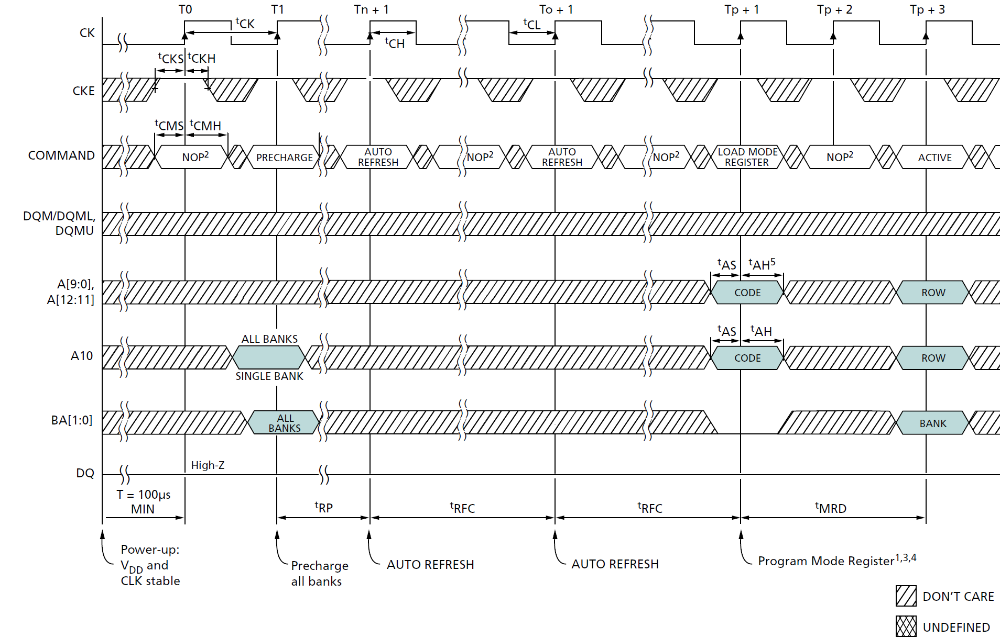

# MT48LC16M16A2TG-75ITD

## Initialization

SDRAM must be powered up and initialized in a predefined manner. Operational procedures other than those specified may result in undefined operation. After power is applied to VDD and VDDQ (simultaneously) and the clock is stable (stable clock is defined as a signal cycling within timing constraints specified for the clock pin), the SDRAM requires a 100μs delay prior to issuing any command other than a COMMAND INHIBIT or NOP. Starting at some point during this 100μs period and continuing at least through the end of this period, COMMAND INHIBIT or NOP commands must be applied.

SDRAM 必须以预定的方式通电和初始化。除了指定的操作程序外的操作都可能导致未定义的行为。在 VDD 和 VDDQ 通电（同时）且时钟稳定后（稳定时钟定义为在时钟引脚指定的时序约束内循环的信号），SDRAM 需要 100μs 的延迟才能发出除 COMMAND INHIBIT 或 NOP 之外的任何命令。从这 100μs 期间的某个时间点开始，至少持续到该期间结束，必须应用 COMMAND INHIBIT 或 NOP 命令。

After the 100μs delay has been satisfied with at least one COMMAND INHIBIT or NOP command having been applied, a PRECHARGE command should be applied. All banks must then be precharged, thereby placing the device in the all banks idle state.

在满足 100μs 的延迟并应用至少一个 COMMAND INHIBIT 或 NOP 命令之后，应执行 PRECHARGE 命令。这样所有的 bank 都会被预充电，从而使设备的所有 bank 进入 IDLE 状态。

Once in the idle state, at least two AUTO REFRESH cycles must be performed. After the AUTO REFRESH cycles are complete, the SDRAM is ready for mode register programming. Because the mode register will power up in an unknown state, it must be loaded prior to applying any operational command. If desired, the two AUTO REFRESH commands can be issued after the LMR command.

一旦处于 IDLE 状态，必须执行至少两个 AUTO REFRESH 周期。AUTO REFRESH 周期完成后，SDRAM 即可进行模式寄存器的编程。由于模式寄存器将在未知状态下启动，因此必须在应用任何操作命令之前加载它。如果需要，两个 AUTO REFRESH 命令也可以在 LMR 命令之后发出。

The recommended power-up sequence for SDRAM:

推荐的 SDRAM 上电顺序：

1. Simultaneously apply power to VDD and VDDQ.
2. Assert and hold CKE at a LVTTL logic LOW since all inputs and outputs are LVTTL-compatible.
3. Provide stable CLOCK signal. Stable clock is defined as a signal cycling within timing constraints specified for the clock pin.
4. Wait at least 100μs prior to issuing any command other than a COMMAND INHIBIT or NOP.
5. Starting at some point during this 100μs period, bring CKE HIGH. Continuing at least through the end of this period, 1 or more COMMAND INHIBIT or NOP commands must be applied.
6. Perform a PRECHARGE ALL command.
7. Wait at least tRP time; during this time NOPs or DESELECT commands must be given. All banks will complete their precharge, thereby placing the device in the all banks idle state.
8. Issue an AUTO REFRESH command.
9. Wait at least tRFC time, during which only NOPs or COMMAND INHIBIT commands are allowed.
10. Issue an AUTO REFRESH command.
11. Wait at least tRFC time, during which only NOPs or COMMAND INHIBIT commands are allowed.
12. The SDRAM is now ready for mode register programming. Because the mode register will power up in an unknown state, it should be loaded with desired bit values prior to applying any operational command. Using the LMR command, program the mode register. The mode register is programmed via the MODE REGISTER SET command with BA1 = 0, BA0 = 0 and retains the stored information until it is programmed again or the device loses power. Not programming the mode register upon initialization will result in default settings which may not be desired. Outputs are guaranteed High-Z after the LMR command is issued. Outputs should be High-Z already before the LMR command is issued
13. Wait at least tMRD time, during which only NOP or DESELECT commands are allowed

1. 同时给 VDD 和 VDDQ 供电。
2. 保持 CKE 为 LVTTL 逻辑低电平，因为所有输入和输出都是 LVTTL 兼容的。
3. 提供稳定的时钟信号。稳定时钟定义为在时钟引脚指定的时序约束内循环的信号。
4. 在发出除 COMMAND INHIBIT 或 NOP 之外的任何命令之前等待至少 100μs。
5. 在这 100μs 期间的某个时间点开始，将 CKE 拉高。至少持续到该期间结束，必须应用 1 个或多个 COMMAND INHIBIT 或 NOP 命令。
6. 执行 PRECHARGE ALL 命令。
7. 等待至少 tRP 时间；在此期间必须给出 NOP 或 DESELECT 命令。所有 bank 都将完成预充电，从而使设备的所有 bank 进入 IDLE 状态。
8. 发出 AUTO REFRESH 命令。
9. 等待至少 tRFC 时间，在此期间只允许 NOP 或 COMMAND INHIBIT 命令。
10. 发出 AUTO REFRESH 命令。
11. 等待至少 tRFC 时间，在此期间只允许 NOP 或 COMMAND INHIBIT 命令。
12. SDRAM 现在已准备好进行模式寄存器编程。因为模式寄存器将在未知状态下启动，所以在应用任何操作命令之前，应将其加载为所需的位值。使用 LMR 命令可以编程模式寄存器。模式寄存器通过 MODE REGISTER SET 命令（BA1 = 0，BA0 = 0）进行编程，并保留存储的信息，直到再次编程或设备断电。在初始化时不编程模式寄存器将导致默认设置，这可能不是所需的。在发出 LMR 命令后，输出保证为高阻态。在发出 LMR 命令之前，输出应该已经是高阻态。
13. 等待至少 tMRD 时间，在此期间只允许 NOP 或 DESELECT 命令

At this point the DRAM is ready for any valid command

此时 DRAM 已准备好接受任何有效命令

Note:
More than two AUTO REFRESH commands can be issued in the sequence. After steps 9 and 10 are complete, repeat them until the desired number of AUTO REFRESH + tRFC loops is achieved.

注意：
在序列中可以发出两个以上的 AUTO REFRESH 命令。在步骤 9 和 10 完成后，重复它们，直到达到所需的 AUTO REFRESH + tRFC 循环次数。

